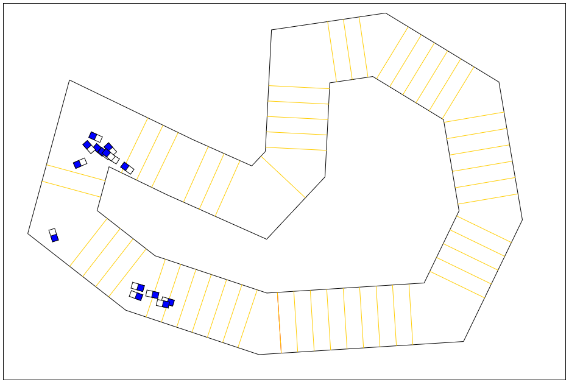

TODO:

* Show preview of the constructed map
* Add button to ask whether track is ok
* Add GUI for parameters
* Add option to delete vertices
* Punish cars for going backwards

* Add score and round indicators to cars

* ~~Weight goalline score depending on the amount of lines in the section~~
* ~~Count number of accomplished laps and add it to the final score~~
* ~~Fix collision~~
* ~~Make goallines shorter~~

----------------

